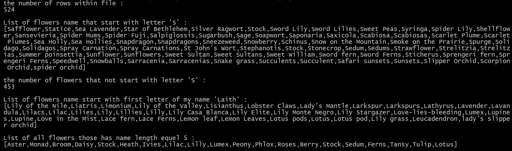

# Laith Mohammed Saker
## Javascript task script
```
//>>node app.js
const fs	 = require('fs');
const flower	 = fs.readFileSync('./flower.txt').toString().split('\n');
//set variables
var num0 	 = 0;			      	//number of rows
var array0	 = new Array();		//list flowers name that start with letter S
var num1	 = 0;			      	//number of flowers that not start with letter S
var array1	 = new Array();		//list of flowers name start with first letter of my name 'Laith'
var array2	 = new Array();		//list of all flowers those has name length equel 5
for (var i = 0; i < flower.length; i++) {
	var flowerName = flower[i];
	if( flowerName != undefined && flower[i] != null && flowerName.length > 0 ){
		//calculating number of rows by increasing num0 by 1 
		num0++;
		//check if flower name is started with letter S
		if ( flowerName[0] == "S" || flowerName[0] == "s" ){ array0.push(flowerName); }
		//check if flower name start with first letter of my name 'Laith'
		if ( flowerName[0] == "L" || flowerName[0] == "l" ){ array1.push(flowerName); }
		//check if flower name has name length equel 5
		if ( flowerName.length == 5 ){ array2.push(flowerName); }
	}
}
//calculating number of flowers that not start with letter S
num1 = num0 - array0.length;
console.log(
"the number of rows within file :\n" + num0 + "\n" + "\n" + 
"List of flowers name that start with letter 'S' :\n[" + array0 + "]\n" + "\n" + 
"the number of flowers that not start with letter 'S' :\n" + num1 + "\n" + "\n" + 
"List of flowers name start with first letter of my name 'Laith' :\n[" + array1 + "]\n" + "\n" + 
"List of all flowers those has name length equel 5 :\n[" + array2 + "]\n"
);
```
## Javascript task results


